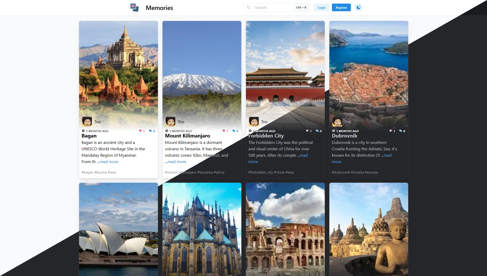

 

  

  <h3 align="center">Memories</h3>

  

  This is my <strong>first</strong> personal MERN project that I built entiery from scratch.
   
The project uses double authentication tokens (access and refrech) approuch, next-gen image format (webp), and account activation via email.
 
 

  

## Demo

**URL**: https://memories.moh-sa.dev

## Built With

| **Client**      | **Server**    |
| :-------------- | :------------ | 
| ReactJs         | ExpressJs     |
| Mantine         | Mongoose      |
| Redux (RTK)     | NodeMailer    |
| Axios           | Cloudinary    |
| react-router    | cookie-parser |
| yup             | dotenv  |
| react-hook-form | cors        |
| react-moment    | bcrypt          |
| react-jwt       | uuid        |
| react-icons     | jsonwebtoken          |

## Tour

https://user-images.githubusercontent.com/46880411/209540393-7474e7d2-b27a-4257-bebc-33479e333f71.mp4
