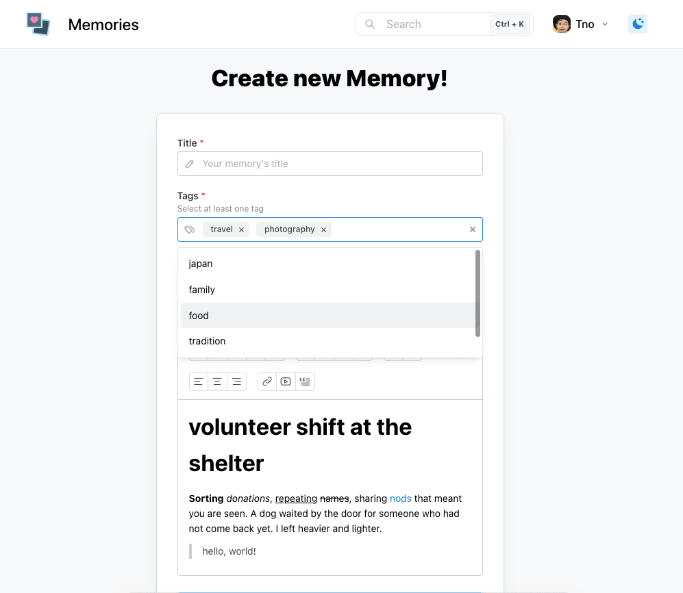
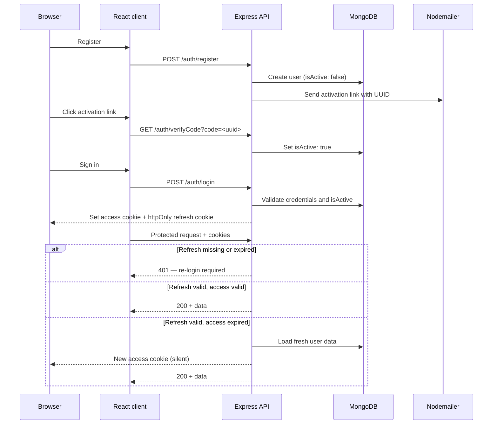

# Memories

A full-stack social platform built with React and Node.js, featuring
cookie-based JWT auth, email activation, rich text posts, and tag-based
Spotlight search.

**Live demo:** [memories.moh-sa.dev](https://memories.moh-sa.dev) ·
**Portfolio:** [moh-sa.dev](https://moh-sa.dev) · **LinkedIn:**
[linkedin.com/in/moh-sa](https://linkedin.com/in/moh-sa)


<details>
<summary>More screenshots</summary>




</details>

## Tour

<https://user-images.githubusercontent.com/46880411/209540393-7474e7d2-b27a-4257-bebc-33479e333f71.mp4>

## Modernization

Originally built in 2023 with Create React App and JavaScript.
Migrated in 2026 to **Vite**, **TypeScript (strict)**, and **Vitest**
with 151 tests at ~78% coverage, plus strict **ESLint v9** rules and
**Husky** pre-commit linting.

The original codebase is preserved in the [v1 branch](https://github.com/moh-sa/memories/tree/v1) for reference.

## Features

- Home feed with paginated memory cards
- Create memories with a Tiptap rich text editor, tags, and a cover image
- Like memories and comments
- Edit or delete your own memories and comments
- Spotlight search (Cmd/Ctrl+K) by title or tag with a dedicated results page
- Recommendations on memory detail pages via MongoDB aggregation
- User profiles with memory and liked lists
- Email activation on registration before login is allowed
- Cookie-based auth with access and refresh JWTs
- Light/dark theme with keyboard shortcut (Cmd/Ctrl+J)

## Engineering highlights

- **Auth:** Cookie-based JWT auth with email activation via Nodemailer. Expired
  access tokens are silently refreshed in middleware on the same request, with
  no dedicated refresh endpoint.
- **Media:** Images converted to base64 on the client and uploaded to Cloudinary
  via JSON body. Stored as public IDs and served with server-generated
  transformation URLs.
- **Search:** Spotlight (Cmd/Ctrl+K) with live title results. Dedicated search
  page supports title and tag queries with pagination.
- **Recommendations:** Related memories fetched via MongoDB aggregation. Uses
  `$match` on shared tags and `$sample` for random selection.
- **Dev proxy:** In development, the Vite server proxies API routes to the
  backend so the client can use a relative base URL.

## Tech stack

| Layer          | Technologies                                                       |
| -------------- | ------------------------------------------------------------------ |
| **Frontend**   | React, TypeScript, Vite, React Router, Redux Toolkit, Mantine, Tiptap, Axios |
| **Backend**    | Node.js, Express, TypeScript, Mongoose                             |
| **Data**       | MongoDB                                                            |
| **Auth**       | Custom JWT (access + refresh cookies)                              |
| **Media**      | Cloudinary                                                         |
| **Email**      | Nodemailer                                                         |
| **Validation** | react-hook-form, Yup                                               |
| **Tooling**    | ESLint + Stylistic, Vitest, Husky, lint-staged    |

## Architecture

### Auth and activation flow


```mermaid
sequenceDiagram
  participant Browser
  participant Client as React client
  participant API as Express API
  participant DB as MongoDB
  participant Email as Nodemailer

  Browser->>Client: Register
  Client->>API: POST /auth/register
  API->>DB: Create user (isActive: false)
  API->>Email: Send activation link with UUID
  Browser->>Client: Click activation link
  Client->>API: GET /auth/verifyCode?code=<uuid>
  API->>DB: Set isActive: true
  Browser->>Client: Sign in
  Client->>API: POST /auth/login
  API->>DB: Validate credentials and isActive
  API-->>Browser: Set access cookie + httpOnly refresh cookie
  Client->>API: Protected request + cookies
  alt Refresh missing or expired
    API-->>Client: 401 — re-login required
  else Refresh valid, access valid
    API-->>Client: 200 + data
  else Refresh valid, access expired
    API->>DB: Load fresh user data
    API-->>Browser: New access cookie (silent)
    API-->>Client: 200 + data
  end
```

## Quick start

**Prerequisites:** Node.js 18+, MongoDB, a [Cloudinary](https://cloudinary.com/)
account, and an SMTP email account for activation emails.

```bash
# Repo root — optional, enables Husky pre-commit linting
npm install

# Terminal 1 — Server (default: http://localhost:5000)
cd server && npm install && cp .env.example .env
npm run seed   # optional — seeds the database with sample data
npm start

# Terminal 2 — Client (default: http://localhost:3000)
cd client && npm install
npm run dev
```

Fill in `server/.env` — `server/.env.example` documents every required variable.
